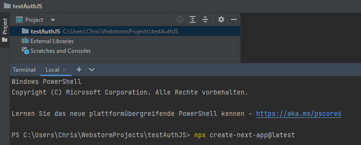
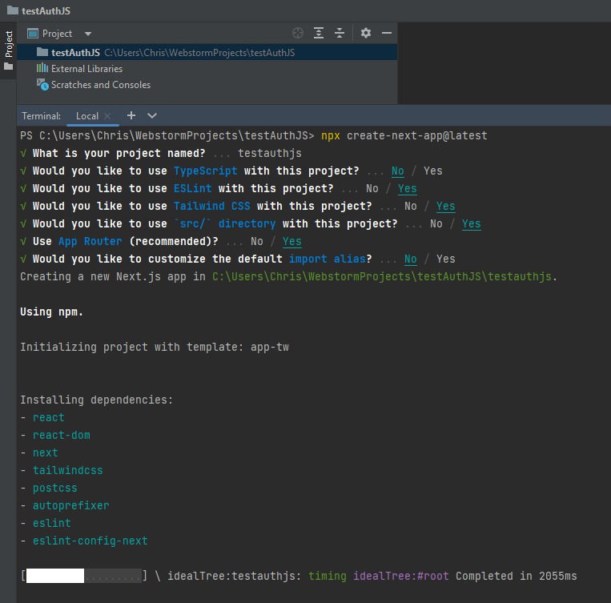
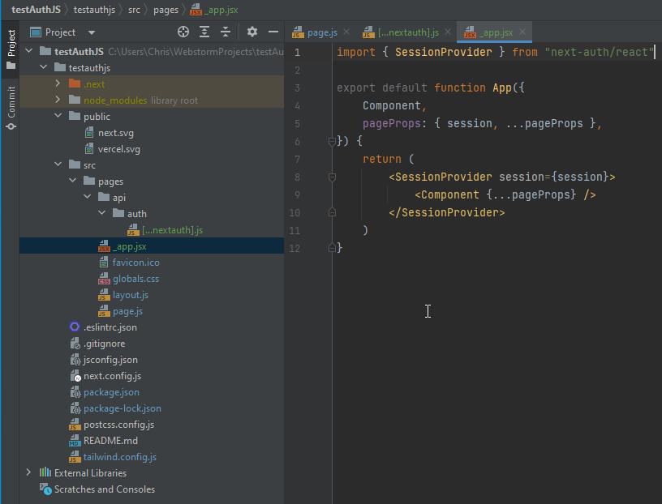
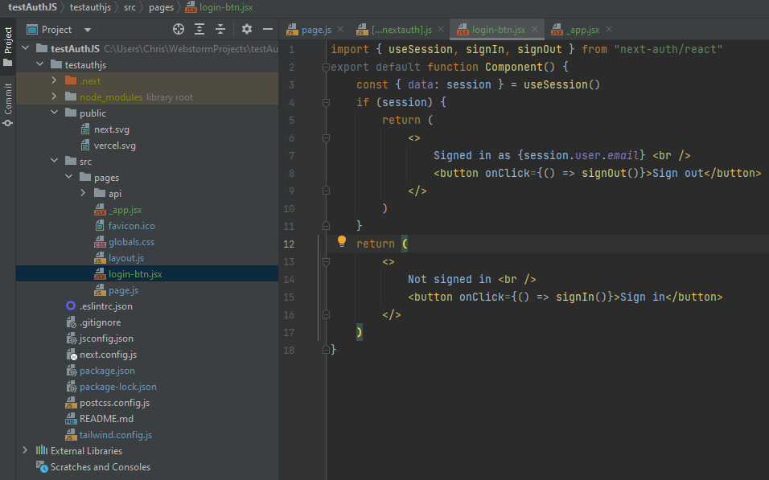
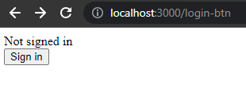
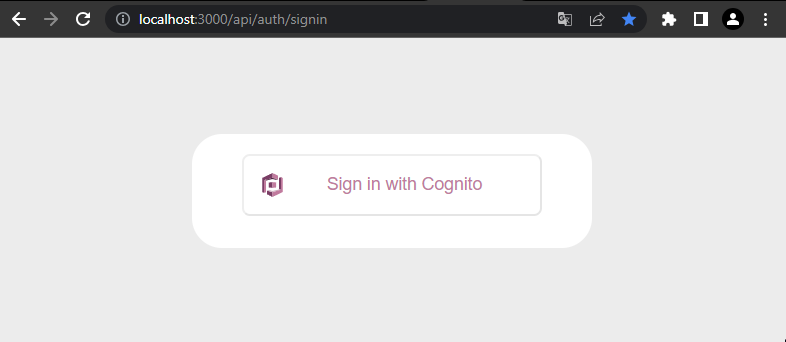
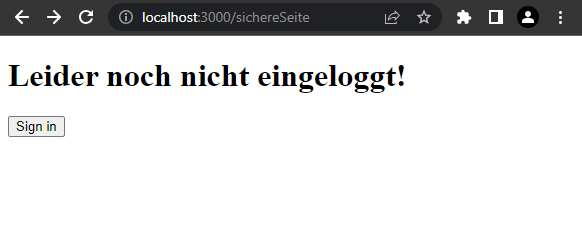
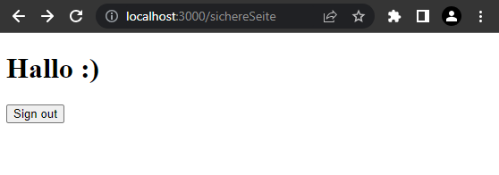

# Einen Login mit AWS Cognito und Auth.js erstellen

### Schritt 1: AWS Cognito Benutzerpool erstellen

Zuerst erstellen wir einen Benutzerpool.


*Die Benutzeroberfäche kann leicht unerschiedlich aussehen, sofern noch kein anderer Benutzerpool erstellt worden ist.*

Hier können wir auch auswählen, ob wir uns auch durch drittanbieter einloggen wollen.
Da wir das aber nicht wollen benutzen wir den "Cognito user pool".

Die Anmeldeoption kann man beliebig festlegen. Hier wählen wir als Demo nur "Email".


Anschließend gehen wir einen Schritt weiter.

Nun können wir die Sicherheitseinstellungen vornehmen.

Hier belassen wir es bei den "Cognito defaults". (Kann aber auch nach Belieben abgeändert werden.)


Im Bereich __Multi-factor authentication__ sollte bei privaten Projekten immer MFA eingestalten werden.
Da wir hier aber nur ein Demoprojekt machen werden wir dies auf Optional setzen und setzen einen Haken bei "Authenticato Apps".

*ACHTUNG:* SMS erzeugt kosten!


Im letzen Abschnitt dieses Schrittes belassen wir alles auf den Standardeinstellungen.


<u>Einstellungen für den E-Mail versand vornehmen:</u>

Wähle hier "Send email with Cognito" aus.

*ACHTUNG:* Amazon SES erzeugt kosten! \
(*Beachte die SES Region!*)


<u>Kapitel: *Integrate your app*</u>

Hier legen wir den Namen unseres Benutzerpools fest und wählen auch, ob wir die gehostete Login-/Registrierungsseite von Cognito benutzen wollen.

Legen Sie Ihren Namen fest und setzten Sie einen Haken bei "Use the Cognito Hosted UI".

  

Nun werden wir auch aufgefordert eine Subdomain anzugeben.
Hier werde ich die Subdomain genauso nennen wir meinen Pool. Dies ist aber nicht notwendig.\
*Es ist auch möglich eine eigene Domain zu verwenden, jedoch muss dafür ein DNS Record geschrieben werden und die benötigten Zertifikate von AWS Certificate Manager besorgt werden.*
              
          

Nun erstellen wir uns einen App-Client. Dies ist __zwingend__ notwendig. Denn dieser ist sozusagen für das Login-/Registrierungspanel verantwortlich.
(Man kann diesen aber auch im Nachhinein erstellen ;) )

Nun wollen wir, das unser Client auch ein Secret besitzt, damit wir später die API mit Auth.js ansprechen können.

Wähle also "Generate a client secret" aus!

Anschließend soll man eine Callback-URL festlegen. Dort werden wir weitergeleitet, nachdem wir uns erfolgreich eingeloggt haben.
Da aber zu diesem Zeitpunkt der Entpunkt wahrscheinlich noch nicht besteht, tragen wir hier "myapp://." ein.  \
*Dies muss später - sobald die Main-Page besteht - nachgetragen werden.*

          

Im letzten Schritt bekommen wir noch einen Überblick über all unsere Einstellungen.
Nachdem wir dies alles überprüft haben erstellen wir unseren User Pool mit "Create user pool".

__*Fertig*__

### Schritt 2: AuthJS mit Cognito verbinden
                                                  
Beginnen wir mit dem Erstellen eines Nextjs Projektes.\
Dies funktioniert recht simple, indem man ein neues Projekt erstellt und anschließend  `create-next-app@latest` \
in die Konsole eingibt.\
<br>
   

Hier kann man sich durchklicken und anschließend hat man ein erstes Demo-Projekt.

 

Nun wollen wir aber AuthJS verwenden in Kombination mit Cognito.\
Dazu geben wir `npm install next-auth` in die Konsole ein.
\
Nachdem alles installiert worden ist ändern wir die Ordnerstruktur ab, damit unser Modul auch zurechtfindet.
- src / pages / api / auth

Anschließend erstellen wir die `[...nextauth].js` Datei. Diese stellt dann schlussendlich unsere Verbindung zu unserem Provider her.


Quellcode:
````javascript
import NextAuth from "next-auth"
import CognitoProvider from "next-auth/providers/cognito";
export const authOptions = {
    // Configure one or more authentication providers
    providers: [
        CognitoProvider({
            clientId: process.env.COGNITO_CLIENT_ID,
            clientSecret: process.env.COGNITO_CLIENT_SECRET,
            issuer: process.env.COGNITO_ISSUER,
        })
    ]
}
export default NextAuth(authOptions)
````

Im nun folgenden müssen ein paar Dateien eingefügt werden. Bei jeder wird erklärt, was diese macht.

Damit wir unsere Session Seitenübergreifend nutzen können, müssen wir diese irgendwie zur Verfügung stellen.
Dies machen wir hier in der `_app.jsx` Datei.

 

Quellcode:
````javascript
import { SessionProvider } from "next-auth/react"

export default function App({
    Component,
    pageProps: { session, ...pageProps },
}) {
    return (
        <SessionProvider session={session}>
            <Component {...pageProps} />
        </SessionProvider>
    )
}
````

Jetzt wollen wir aber vielleicht aber auch einen Login-Button damit wir uns einloggen können.
Dazu überprüfen wir zuerst, ob wir eingeloggt sind und geben dann den entsprechenden Button zurück.

Siehe Beispiel:



Quellcode:
````javascript
import { useSession, signIn, signOut } from "next-auth/react"
export default function Component() {
    const { data: session } = useSession()
    if (session) {
        return (
            <>
                Signed in as {session.user.email} <br />
                <button onClick={() => signOut()}>Sign out</button>
            </>
        )
    }
    return (
        <>
            Not signed in <br />
            <button onClick={() => signIn()}>Sign in</button>
        </>
    )
}
````

Und das hier ist unser kleiner Login-Button. :)



Sobald wir darauf klicken, werden wir auch schon zu unserem Provider - in diesem Falle AWS Cognito - weitergeleitet.

 

Viel Spaß. :D


*__Bonus:__ Weitere Seiten einbinden*

Jetzt wollen wir aber z.B. mehrere Seiten geschützt haben durch unsere Session.
Dies können wir folgendermaßen erreichen:
- Einfach eine neue `Datei.js` in unserem Hauptverzeichnis erstellen und `import { useSession, signIn, signOut } from "next-auth/react"`
benutzen. 
- Hier wurden jetzt noch die Buttons mit eingefügt. Diese muss man natürlich nicht einfügen wenn man sich schon auf der vorherigen Seite eingeloggt hat. Wichtig ist es halt, das man zu 
beginn jeder Seite übeprüft, ob man eingeloggt ist.

So sieht es dann in Aktion aus:
<div style="text-align:center">


</div>

Und hier ist der Quellcode:
```javascript
import { useSession, signIn, signOut } from "next-auth/react"

export default function Profil() {
    const { data: session } = useSession()
    if (!session) {
        return(
            <div>
            <h1>Leider noch nicht eingeloggt!</h1>
            <button onClick={() => signIn()}>Sign in</button>
            </div>
        )
    } else {
        return (
            <div>
                <h1>Hallo :)</h1>
                <button onClick={() => signOut()}>Sign out</button>
            </div>
        )
    }
}
```
Anmerkung: Damit man sich mit Cognito auch einloggen kann muss man seine AWS Cognito Zugangsdaten hinterlegen.
Diese Daten werden im Normalfall in der `.env` Datei abgelegt. Diese Datei sollte PRIVAT bleiben.
```gitignore
COGNITO_CLIENT_ID= 
COGNITO_CLIENT_SECRET=
COGNITO_ISSUER=
```